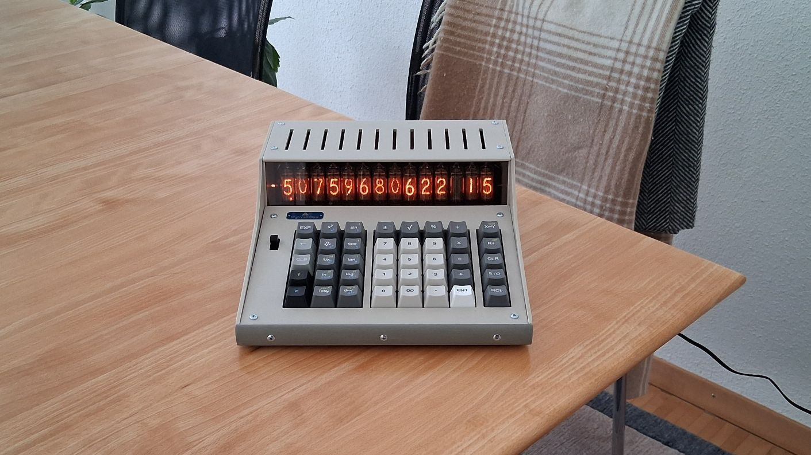
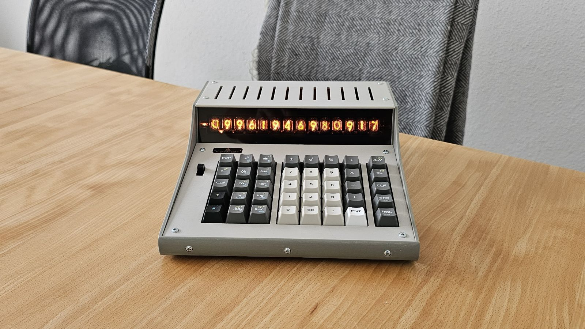
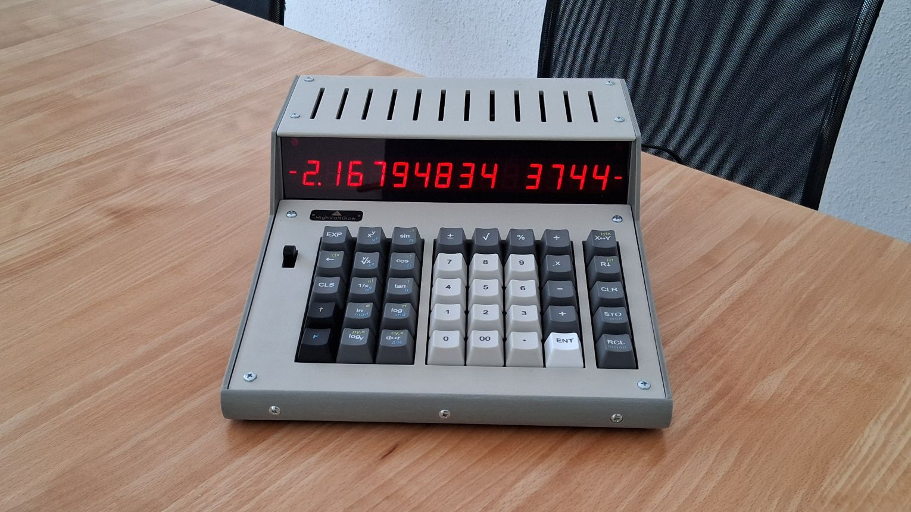
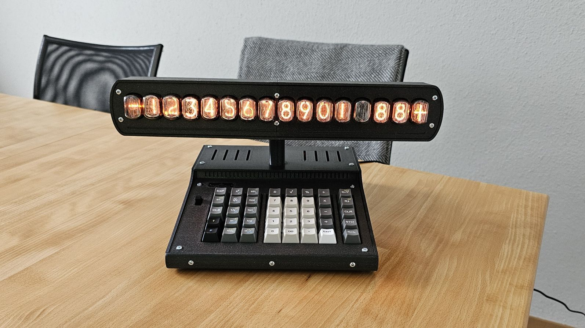
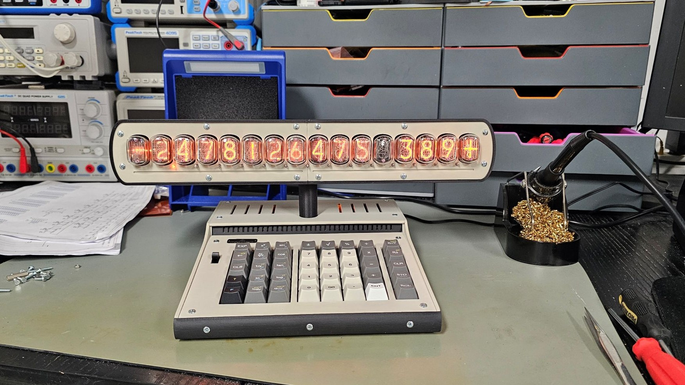
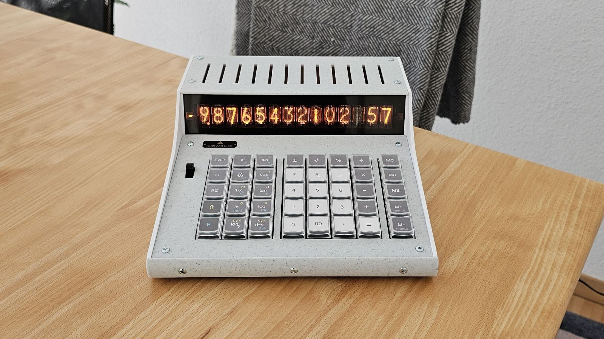
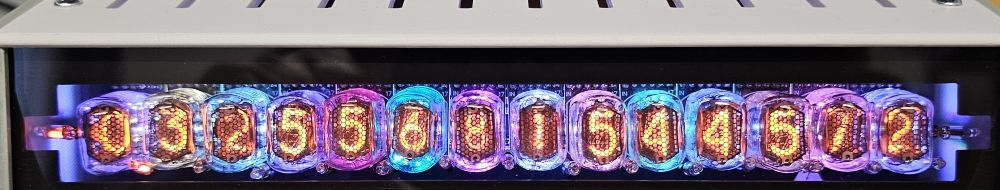
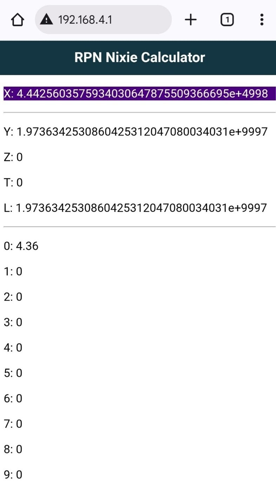
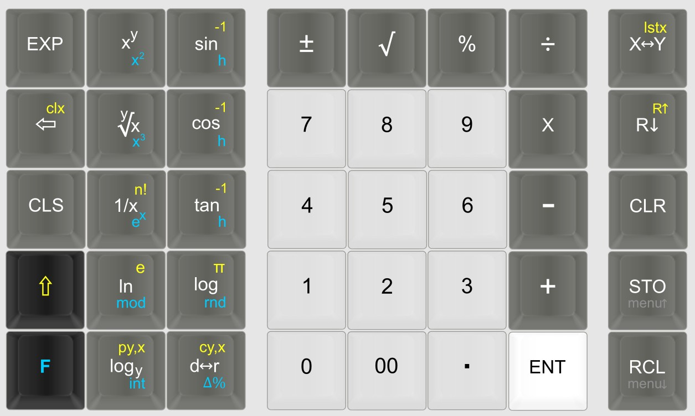
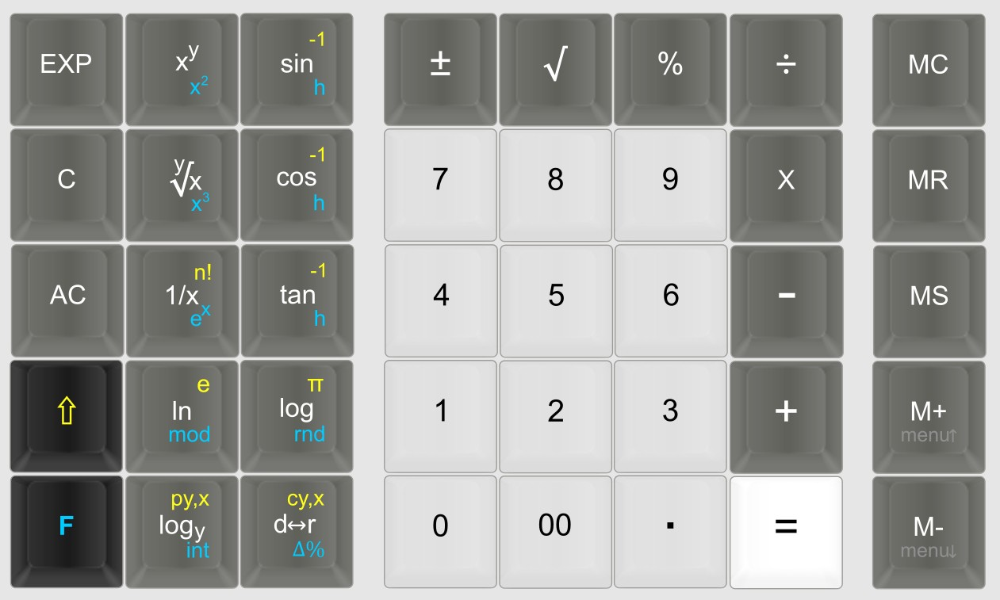

### Nixie Calculator - RPN | Algebraic

#### This repository contains some information and ideas for building a nixie calculator and is provided *as-is* for educational, experimental, and hobbyist purposes only. However, this repository is only intended for suitable qualified electronics engineers. The project has not been tested for compliance with electrical, safety, or electromagnetic standards (e.g., CE, FCC). 
##
>[!WARNING]
> 
> #### Nixie tubes and associated circuitry operate at potentially dangerous voltages. If you choose to build or use the calculator, you are doing so at your own risk.

>[!IMPORTANT]
>- **Please read all documents in [Docs](Docs) before deciding whether to build the calculator.**

>[!NOTE]
> - **Be aware that I'm just an electronics hobbyist and nixie enthusiast.**
> - **I'm not affiliated with any of the service providers mentioned in this project.**
> - **No HP source code was used to develop the RPN firmware.**
##
#### Project Status 
- **Software: ready to be reviewed**
- **Hardware: ready to be reviewed**

#### Project video
https://www.youtube.com/watch?v=e9KX7zf6a1A

#### Features:
-	4 nixie versions: IN-12/IN-15A, IN-16, IN-17 and B-5870
-	alternative 7-segment LED version 
-	2 calculator engines: RPN (reverse polish notation) or algebraic
- 14 digits with decimal points, minus signs and dynamic scientific notation
-	arbitrary-precision arithmetic up to 32 digits (experimental)
-	30+ math operations
-	easy nixie replacement
- LED backlighting/underlighting (nixie versions only)
-	mechanical keyboard with 40 switches
-	custom keycap legends and colors
-	WebSocket server option to display the stack and memory registers on a smartphone or pc
-	RTC with battery backup
-	clock, stopwatch and timer modes
-	ESP32 based controller board
-	PIR, GPS and temperature sensor module (optional)
-	works with a standard DC 12V/2A regulated power supply (wall wart)
-	no network connection is needed (all the settings are adjusted using the keyboard)
-	3D printed case
-	open-source firmware

**RPN IN-16 version**

**RPN IN-17 version**

**RPN 7-seg LED version**

**RPN IN-12B / IN-15A version** 

**RPN IN-12A / IN-15A version**

**Algebraic B-5870 version with self-printed keycap legends** 

**All nixie versions have LED lighting**

**Stack and memory registers can be displayed on a smartphone** 
 

**RPN keyboard layout** 
 

**Algebraic keyboard layout** 
 

