## Nixie Calculator - RPN | Algebraic 

 

#### This repository contains some information and ideas for building a nixie calculator and is provided *as-is* for educational, experimental, and hobbyist purposes only. However, this repository is only intended for suitably qualified electronics engineers. The project has not been tested for compliance with electrical, safety, or electromagnetic standards (e.g., CE, FCC). 

##
>[!WARNING]
> 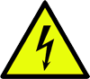
> #### Nixie tubes and associated circuitry operate at potentially dangerous voltages. If you choose to build or use the calculator, you are doing so at your own risk.

>[!IMPORTANT]
>- **Start with [this document](Docs/README.md).**

>[!NOTE]
> - **The project is not affiliated with any of the service providers mentioned in this repository.**
> - **No HP code was used to develop the RPN firmware.**
##
#### Project Status 
- **Software: ready to be reviewed**
- **Hardware: ready to be reviewed**

#### Project video
https://www.youtube.com/watch?v=CKAuJhKjPZ4

#### Features
-	4 nixie versions: IN-12/IN-15A, IN-16, IN-17 and B-5870
-	alternative 7-segment LED version 
-	2 calculator engines: RPN (reverse polish notation) or algebraic
- 14 digits with decimal points, minus signs and dynamic scientific notation
-	arbitrary-precision arithmetic up to 32 digits (experimental)
-	30+ math operations
-	easy nixie replacement
- LED backlighting/underlighting (nixie versions only)
-	mechanical keyboard with 40 switches
-	custom keycap legends and colors
-	RTC with battery backup
-	clock, stopwatch and timer modes
-	ESP32 based controller board
-	PIR, GPS and temperature sensor module (optional)
-	works with a standard DC 12V/2A regulated power supply (wall wart)
-	3D printed case
-	no network connection is needed; all settings can be adjusted using the keyboard
- Optional web based features: configuration, device mirroring and stack register display
-	open-source firmware

#### RPN IN-16 version
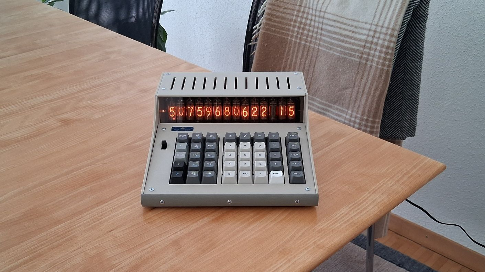

#### RPN IN-17 version
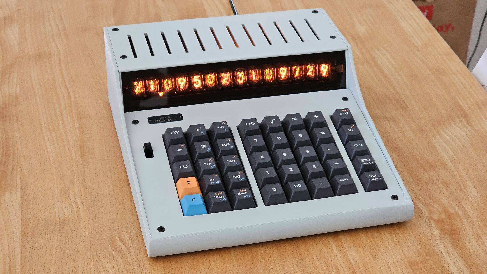

#### RPN 7-seg LED version
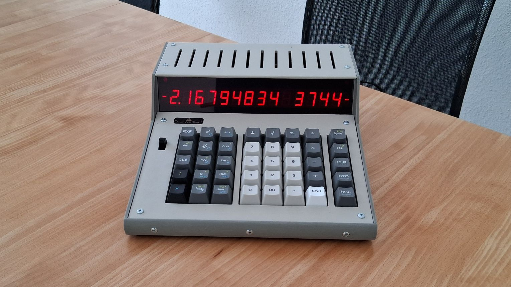

#### RPN IN-12B / IN-15A version
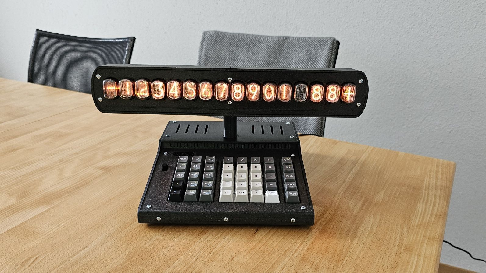

#### RPN IN-12A / IN-15A version
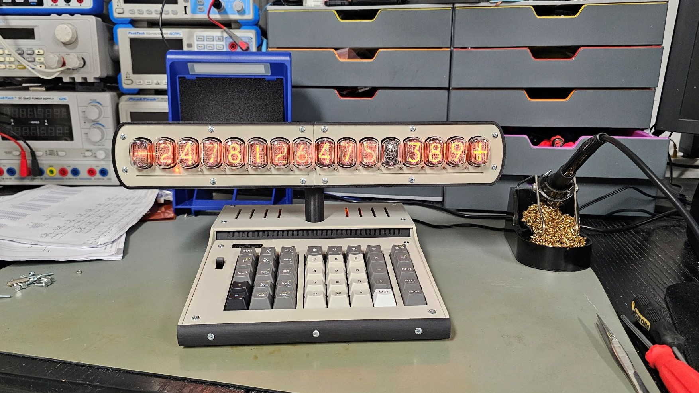

#### Algebraic B-5870 version with self-printed keycap legends
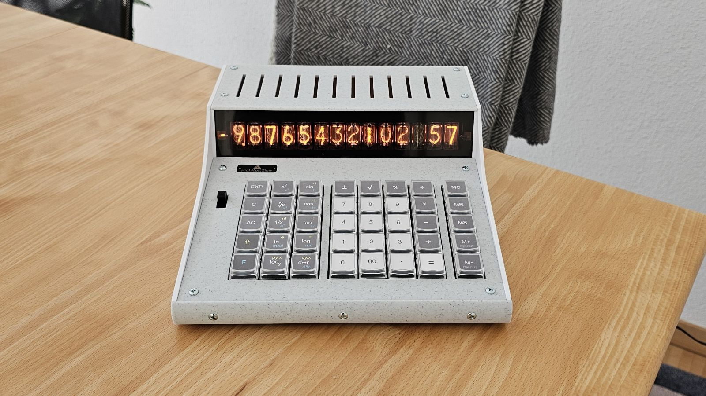

#### ИН-16 (IN-16) nixie tubes - production probably started in 1972
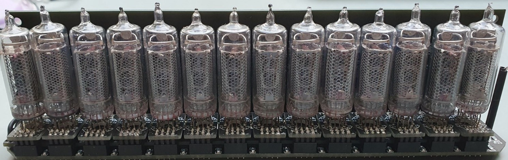

#### All nixie versions have LED lighting
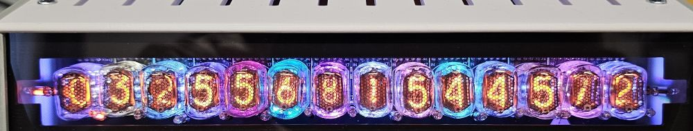

#### Controller board with 3D models
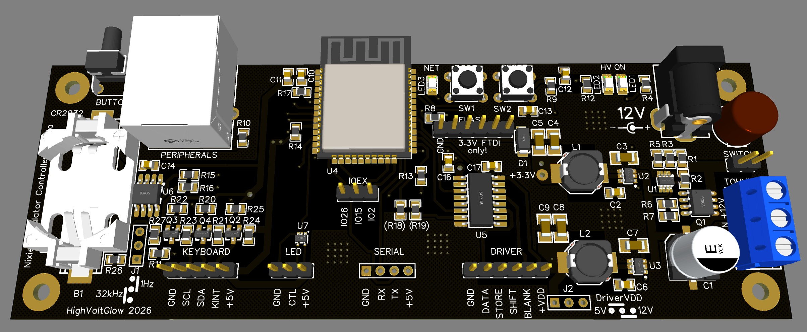

#### Exposed RPN keyboard
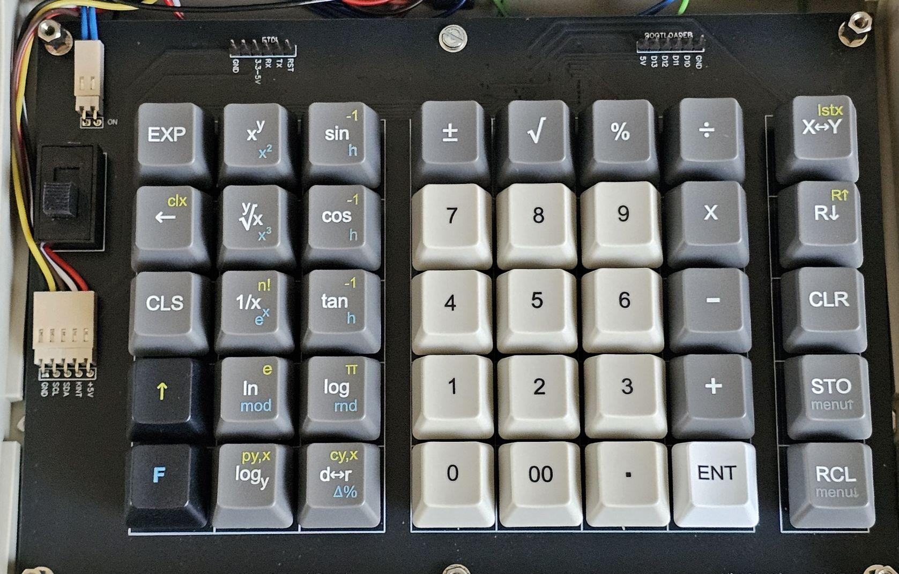 

##
#### Calculator keypad and stack registers displayed on a smartphone
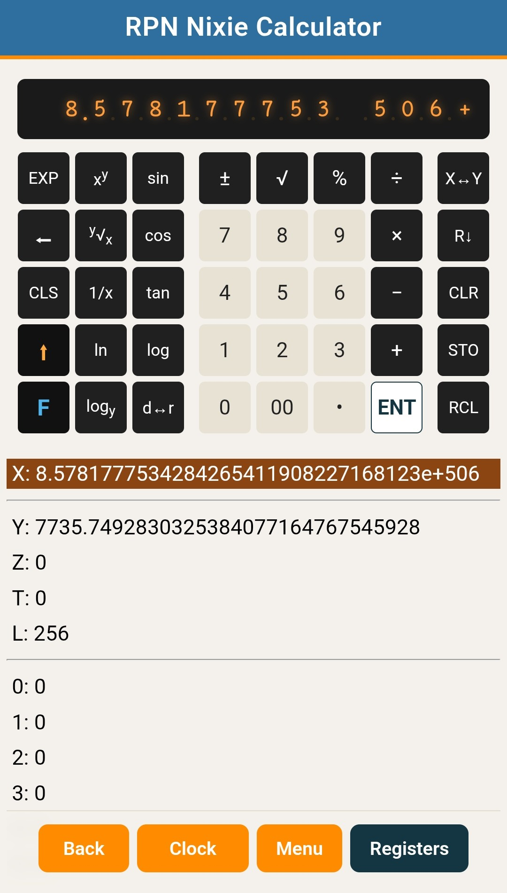 

#### The status page shows some information about the calculator
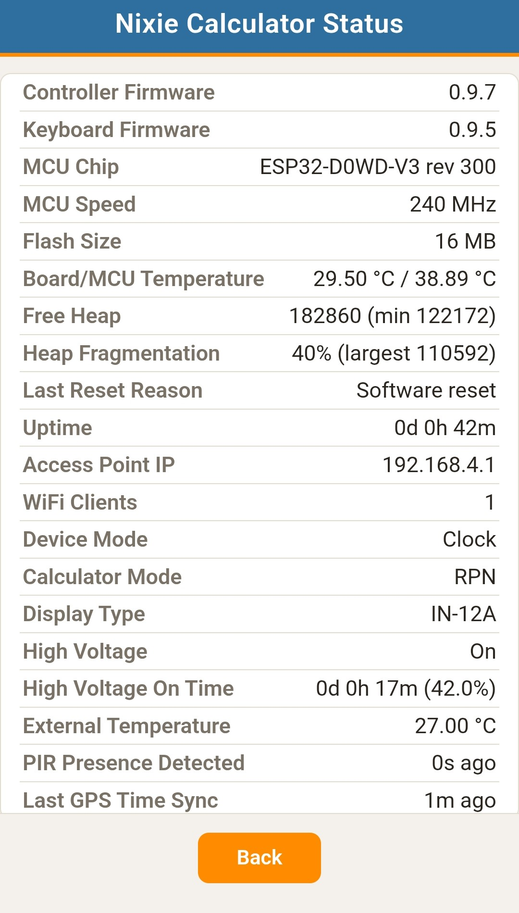 

#### The calculator can be configured directly with the keyboard or using the web interface
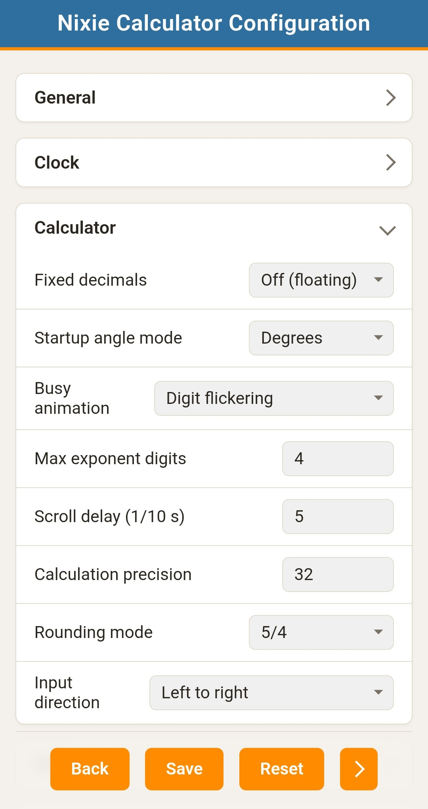
